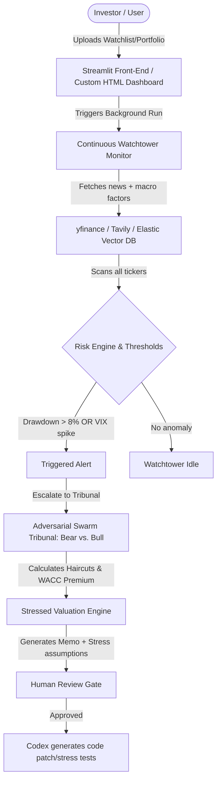

# Doomsday V2: Investor Desk Upgrade Strategy
Recommendations & Task Delegation Roadmap

This document outlines the strategy for duplicating your current **Doomsday Rapid Agent** codebase, renaming it, and upgrading it into a professional, portfolio-wide investor risk management desk (Doomsday V2). It provides a concrete plan for directory setup, architecture transition, HTML/CSS dashboard integration, and AI task delegation.

---

## 1. Folder Setup & Naming Recommendations

To keep your original project untouched while building a premium, hackathon-ready submission, you should duplicate the directory into a dedicated folder.

### Recommended Names
* **`Doomsday_Watchtower_Desk`** (Highly recommended: emphasizes the continuous, automated monitoring aspect)
* **`Doomsday_Investor_Agent`** (Emphasizes the dedication to investor/portfolio-level workflow)
* **`Doomsday_Risk_Orbit`** (Sounds premium, aligned with the radar/threat orbital visual)

### Windows PowerShell Safe Duplication Command
To duplicate the folder without copying heavy media files (like the 100MB+ `.mp4` demo recordings) and temp cache, open PowerShell and run:

```powershell
# Copy the codebase excluding cached files and heavy video demos
Copy-Item -Path "c:\Users\Moosa\Downloads\Doomsday_Rapid_Agent" `
          -Destination "c:\Users\Moosa\Downloads\Doomsday_Watchtower_Desk" `
          -Recurse `
          -Exclude "*.mp4", "__pycache__", ".git", ".env"

# Copy the environment file separately (so you retain configuration keys)
Copy-Item -Path "c:\Users\Moosa\Downloads\Doomsday_Rapid_Agent\.env" `
          -Destination "c:\Users\Moosa\Downloads\Doomsday_Watchtower_Desk\.env"
```

---

## 2. Architectural Blueprint: Transitioning to Portfolio Risk

Your original codebase is structured to analyze **one stock at a time**. The new version must scale to a **portfolio/watchlist context**. Here is the architectural mapping:



### Proposed File Architecture Changes

* **`portfolio_manager.py` [NEW]**:
  * Manages the importing of watchlists (Ticker, weights, average cost).
  * Calculates portfolio-level Beta and weighted Drawdown.
* **`automation_watchtower.py` [NEW]**:
  * Background script that runs periodically or in a fast loop to fetch prices via `yfinance`, VIX, and news via `Tavily`.
  * Generates the `data/incidents.json` whenever risk thresholds are breached.
* **`valuation_engine.py` [MODIFY]**:
  * Integrate custom jurisdiction stress scenarios.
  * Add support for portfolio-wide value-at-risk (VaR) under stress.

---

## 3. Integrating the Premium Dashboard V2 Demo

Claude built a beautiful HTML front-end (`doomsday_v2_demo (1).html`) containing vibrant styles, HSL dark-mode colors, **HTML5 Canvas Threat Orbits**, and a **3D Canvas rotating Sector Cube**. 

To port this beautiful interface into your Streamlit-based project:

1. **Theme Injection**:
   Inject the CSS stylesheet directly at the top of your `app.py` script:
   ```python
   import streamlit as st
   with open("doomsday_v2_demo (1).html", "r", encoding="utf-8") as f:
       # Extract the <style> block content and inject it
       styles = extract_css_from_html(f.read())
       st.markdown(f"<style>{styles}</style>", unsafe_allow_html=True)
   ```
2. **Porting HTML/JS Visual Components (Threat Orbit & 3D Cube)**:
   Streamlit supports embedding rich HTML/Javascript/Canvas elements via components. You can render the exact interactive canvas from Claude's demo using:
   ```python
   import streamlit.components.v1 as components
   
   # Wrap the Canvas + script animations from the demo in an iframe container
   components.html(
       """
       <html>
         <head>
           <style>body { background: #050810; margin: 0; overflow: hidden; }</style>
         </head>
         <body>
           <canvas id="orbitCanvas" style="width:100%; height:400px;"></canvas>
           <script>
             // Injected JS logic from line 621-883 of the HTML demo
           </script>
         </body>
       </html>
       """,
       height=420
   )
   ```

---

## 4. AI Task Delegation Matrix

To build this fast and hit the hackathon scorecard (which rewards technical execution, usefulness, creativity, and Codex integration), delegate tasks systematically:

| Task Area | Delegated To | Rationale / Prompting Context |
| :--- | :--- | :--- |
| **Front-End & Theme Porting** | **Claude** | Claude is highly adept at CSS/HTML layouts. Ask Claude: *"Take the styling and canvas code from `doomsday_v2_demo.html` and package it into Streamlit component code to replace our old dashboard layouts in `app.py`."* |
| **Adversarial Prompts & JSON Schema** | **Claude** | Claude excels at writing structured prompt templates. Ask Claude to write the prompts that generate Bear/Bull arguments referencing portfolio weights and company-specific leverage. |
| **Model Stress Patches (The Codex Core)** | **Codex (OpenAI)** | This is your hackathon highlight. Let Codex act as the automated backend developer. When a user approves a stress test recommendation, prompt Codex via API: *"Generate a Python subclass `ExportControlStress` for `valuation_engine.py` using these parameters... and write a unit test for it."* |
| **Unit Testing & Regressions** | **Codex (OpenAI)** | Codex excels at writing strict boilerplate tests. Delegate the creation of `test_regression_cases.py` to ensure that old valuations don't break when Codex patches the engine. |
| **Data Engine & Watchtower Loop** | **Developer (You)** | The background thread logic, scheduling, and error handling for APIs (`yfinance`, `Tavily`) are best handled by the human developer to ensure solid process management and prevent rate-limiting or API key leakage. |
| **MCP Telemetry Integration** | **Developer (You)** | Setting up Elastic MCP and Arize Phoenix tracing spans requires linking API endpoints and environment variables, which the developer should configure and verify locally. |

---

## 5. Phase-by-Phase Roadmap

### Phase 1: Infrastructure & Data Loop (Day 1-2)
* [ ] Duplicate the folder using the PowerShell command above.
* [ ] Create `portfolio_manager.py` with mock portfolios (e.g., Tech Heavy, Semi Concentrated, Consumer Defensive).
* [ ] Write a script `automation_watchtower.py` that queries prices and triggers a simple threshold check (VIX > 25, drawdown > 8%).

### Phase 2: Frontend Transition (Day 3-4)
* [ ] Port Claude's styling into Streamlit (`THEME_CSS` in `app.py`).
* [ ] Embed the Threat Orbit canvas in a Streamlit container for visual impact.
* [ ] Map the "Incident Queue" inside the app to load different tickers from `incidents.json` dynamically.

### Phase 3: The Codex Loop (Day 5)
* [ ] Setup a "Codex Panel" where the output of the Tribunal is translated into a prompt task packet.
* [ ] Implement a dry-run button that displays the proposed code changes (the patch preview in Claude's demo HTML).
* [ ] Connect it to the live API or simulate the patch merging into `valuation_engine.py`.

### Phase 4: Telemetry & Polish (Day 6-7)
* [ ] Verify that Arize trace spans track the Bear vs. Bull rounds correctly.
* [ ] Generate the final PDF / Markdown report download for the Investment Committee Memo.
* [ ] Record the demo video following the **Demo Story** defined in your kick-off notes.

---
> [!TIP]
> **Hackathon Secret**: Judges love to see the "human-in-the-loop" approval process. When presenting your project, frame the "Codex Patch" not as an uncontrolled AI writing code directly to production, but as a **Copilot proposing a stressed model variant** which the analyst validates and merges with a single click.
