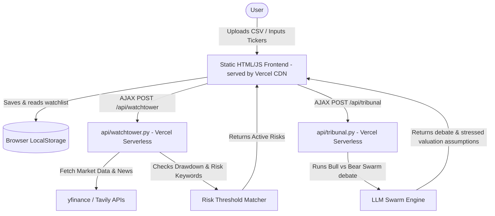

# Implementation Plan - Aegis_Codex Vercel Serverless Architecture

This plan outlines the migration from a Streamlit-based deployment to a **Vercel Serverless Architecture** for **Aegis_Codex**. This prevents hosting delays (like Streamlit container sleep) by serving the frontend instantly via CDN and executing backend logic via Python serverless functions.

---

## User Review Required

> [!IMPORTANT]
> **Vercel Deployment Advantages:**
> * **Zero Wake-Up Delay:** The dashboard (HTML/CSS/JS) is served instantly via Vercel's global edge network.
> * **Stateless Serverless Backend:** Python logic (yfinance, Tavily, LLM tribunal) runs inside Vercel's `/api` serverless functions.
> * **Browser-Side Persistence (`localStorage`):** Portfolios, watchlists, and active incident records are saved directly in the user's browser `localStorage`. This eliminates the need for a server database, ensures zero multi-user interference (each judge has their own isolated watchlist), and maintains zero setup friction.

---

## Proposed Architecture & Data Flow



### 1. File Structure for Vercel

```
Aegis_Codex/
├── index.html                 # Main dashboard (renamed & adapted from doomsday_v2_demo.html)
├── vercel.json                # Vercel configuration (specifying Python runtime)
├── requirements.txt           # Python backend dependencies (yfinance, requests, google-genai, etc.)
├── api/                       # Python serverless function directory
│   ├── watchtower.py          # Watchlist scanner endpoint (/api/watchtower)
│   ├── tribunal.py            # Adversarial debate & judgment endpoint (/api/tribunal)
│   ├── valuation.py           # Stressed DCF engine endpoint (/api/valuation)
│   └── codex.py               # Codex task and code patch generator (/api/codex)
├── valuation_engine.py        # Core valuation library imported by serverless functions
└── agent_swarm.py             # Swarm logic imported by serverless functions
```

### 2. Client-Backend API Specifications

* **`/api/watchtower`**:
  * **Input:** `{"tickers": ["NVDA", "TSM", "ASML"]}`
  * **Process:** Runs yfinance queries, checks drawdowns, runs Tavily keyword scans.
  * **Output:** JSON list of active incidents and market metrics (VIX, DXY, DXY trend, DXY levels).
  
* **`/api/tribunal`**:
  * **Input:** `{"ticker": "NVDA", "incident": "EAR-99 China datacenter exit forced"}`
  * **Process:** Launches Bear vs. Bull debate using LLM Swarm, runs judgment node.
  * **Output:** Transcript of rounds and proposed stressed WACC / revenue haircut assumptions.

* **`/api/valuation`**:
  * **Input:** `{"ticker": "NVDA", "assumptions": {"haircut": 0.28, "wacc_delta": 380, "margin_delta": 420, "terminal_delta": -1.2}}`
  * **Process:** Performs multi-factor DCF and builds waterfall chart data.
  * **Output:** Enterprise valuation outputs and waterfall steps.

---

## Proposed Changes

### [Aegis_Codex Vercel Setup]

#### [NEW] [vercel.json](file:///c:/Users/Moosa/Downloads/Aegis_Codex/vercel.json)
* Configures Vercel to route all requests in `api/` to the Python serverless runtime.

#### [NEW] [index.html](file:///c:/Users/Moosa/Downloads/Aegis_Codex/index.html)
* Move and rename the demo HTML to the root directory.
* Replace the static mock data arrays and triggers with `fetch()` calls to `/api/...` endpoints.
* Wire up the CSV/ticker inputs to save to and load from `localStorage`.

#### [NEW] [api/watchtower.py](file:///c:/Users/Moosa/Downloads/Aegis_Codex/api/watchtower.py)
* Entry point for watchlist checks. Parses request and calls yfinance/Tavily.

#### [NEW] [api/tribunal.py](file:///c:/Users/Moosa/Downloads/Aegis_Codex/api/tribunal.py)
* Entry point for running LLM swarm debates on loaded incidents.

#### [NEW] [api/valuation.py](file:///c:/Users/Moosa/Downloads/Aegis_Codex/api/valuation.py)
* Entry point for stressed DCF calculations using `valuation_engine.py`.

---

## Verification Plan

### Manual Verification
- Deploy to Vercel locally using the Vercel CLI: `vercel dev`.
- Access the app on `http://localhost:3000`.
- Verify the landing page loads instantly without cold starts.
- Import a test portfolio (CSV or text) and verify it persists in browser storage across page refreshes.
- Trigger a Watchlist Scan, and verify that request data is routed to `/api/watchtower`, returning live metrics to the dashboard.
